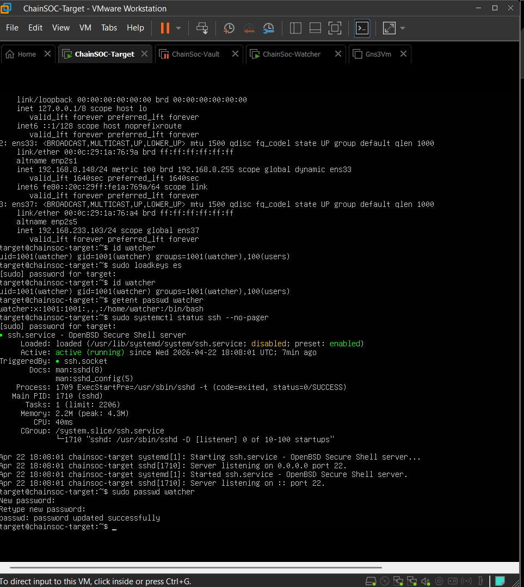
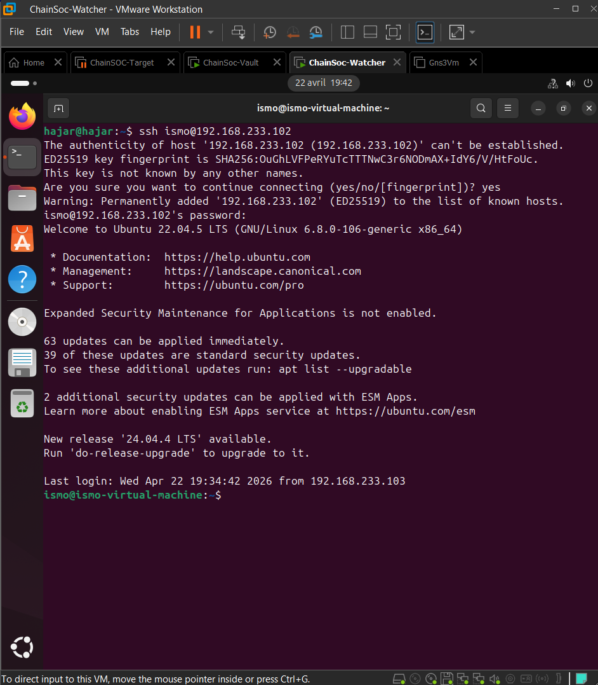
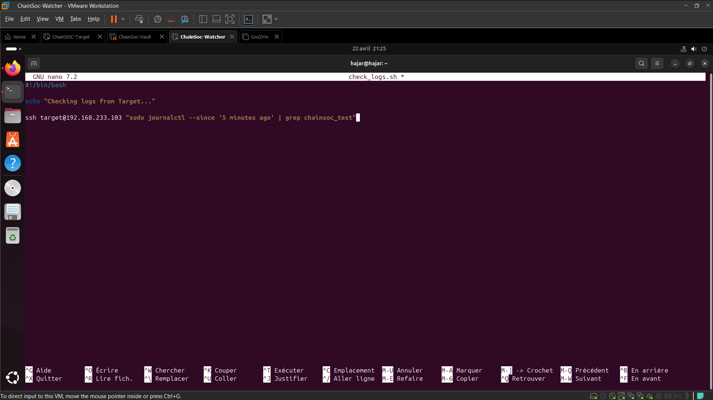
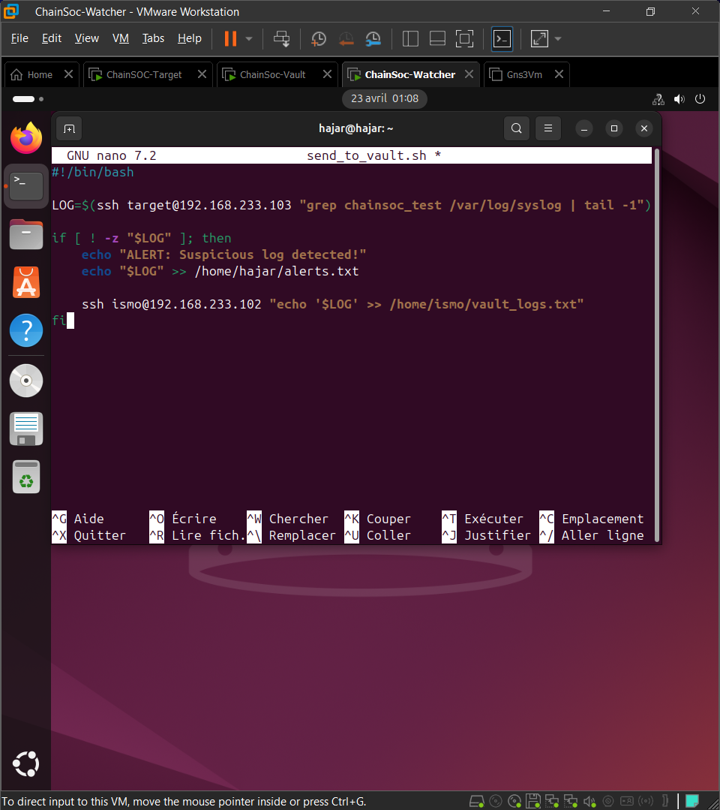
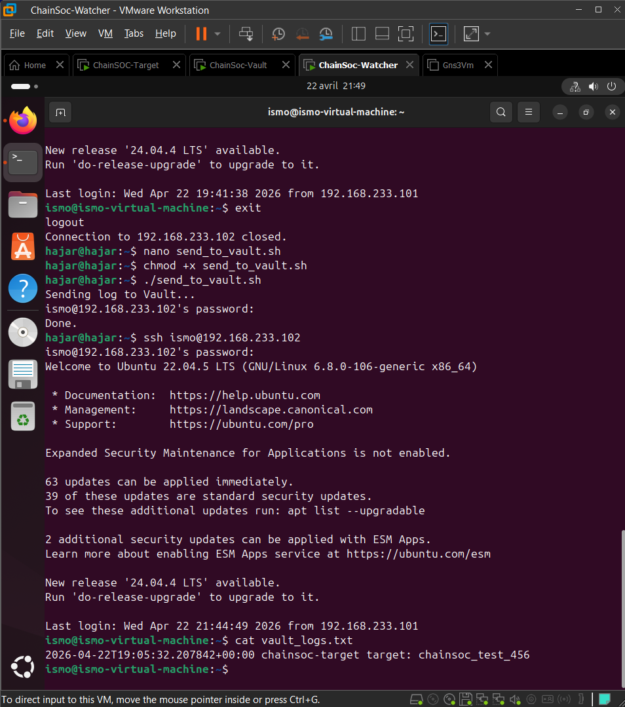
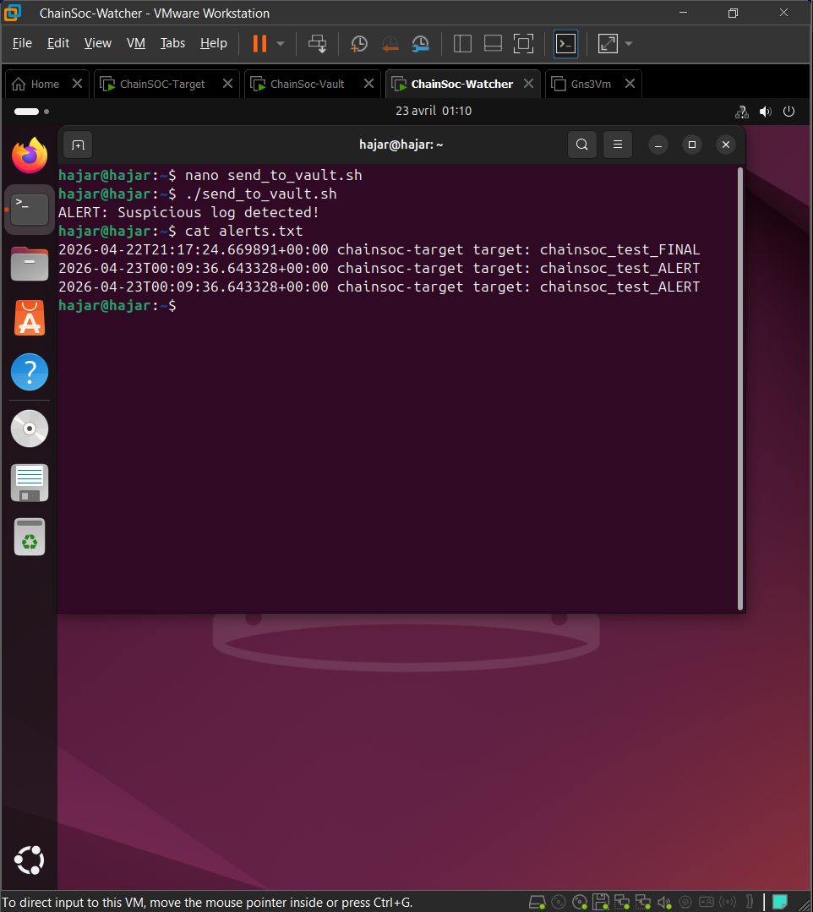

# Chain-Soc-Updates
# ChainSOC -- Decentralized SIEM Prototype

<br>

## Project Overview

ChainSOC is a security monitoring prototype that uses three virtual machines to collect, analyze, and store system logs in a decentralized way.

The Target machine generates logs. The Watcher machine retrieves them via SSH, checks for suspicious entries, and sends everything to the Vault machine for secure storage. The whole pipeline runs automatically every minute using a cron job.

<br>

---

<br>

## Architecture

```
+-------------------+         +-------------------+         +-------------------+
|   Target Machine  |  SSH    |  Watcher Machine  |  SSH    |   Vault Machine   |
|                   | ------> |                   | ------> |                   |
|  - Generates logs |         |  - Retrieves logs |         |  - Stores logs    |
|  - Simulates      |         |  - Detects threats|         |  - vault_logs.txt |
|    suspicious     |         |  - Sends alerts   |         |                   |
|    activity       |         |  - Forwards logs  |         |                   |
+-------------------+         +-------------------+         +-------------------+
```

**Flow:** Target generates logs --> Watcher retrieves and analyzes them --> Watcher detects threats and creates alerts --> Watcher forwards logs to Vault --> Vault stores everything securely.

<br>

---

<br>

## Technologies Used

| Technology         | Purpose                                    |
|--------------------|--------------------------------------------|
| Ubuntu 24.04 LTS   | Target machine OS                          |
| Ubuntu 22.04 LTS   | Watcher and Vault machines OS              |
| VMware Workstation  | Virtualization platform                    |
| SSH (OpenSSH)      | Secure communication between all machines  |
| Bash Scripting     | Log retrieval, detection, and forwarding   |
| Cron Jobs          | Automated scheduling (every minute)        |
| journalctl / syslog| Log generation and querying                |
| React              | Dashboard prototype                        |

<br>

---

<br>

## Implementation Steps

<br>

### Step 1: Target Network Configuration

The Target machine was set up with two network interfaces: `ens33` (DHCP, for internet) and `ens37` (static IP `192.168.233.103/24`, for the internal ChainSOC network). Configuration was done via Netplan.


<br>

### Step 2: SSH Setup and User Creation

SSH was enabled on the Target machine. A dedicated `watcher` user was created so the Watcher machine could connect remotely. The SSH service was verified as active on port 22.



<br>

### Step 3: SSH Communication Between Machines

SSH connections were established between all three machines:

- Watcher connects to Target (`192.168.233.103`) to retrieve logs.
- Watcher connects to Vault (`192.168.233.102`) to forward logs.



<br>

### Step 4: Log Generation on Target

Test logs were created on the Target using the `logger` command and verified with `journalctl`.


<br>

### Step 5: Watcher Log Retrieval

A Bash script (`check_logs.sh`) was written on the Watcher to automatically SSH into the Target and retrieve recent logs matching `chainsoc_test`.




<br>

### Step 6: SSH Key-Based Authentication

SSH keys were generated on the Watcher (`ssh-keygen`) and copied to the Target (`ssh-copy-id`) so that all connections run without requiring a password.


<br>

### Step 7: Log Forwarding to Vault

A second script (`send_to_vault.sh`) was created on the Watcher. It retrieves logs from the Target, checks for suspicious entries, and forwards them to `vault_logs.txt` on the Vault machine via SSH.





<br>

### Step 8: Alert Detection

When the script finds a suspicious log entry, it prints `"ALERT: Suspicious log detected!"` and saves the entry to `alerts.txt` on the Watcher.



<br>

### Step 9: Cron Automation

The `send_to_vault.sh` script was added to crontab to run every minute (`* * * * *`). This automates the entire pipeline: retrieval, detection, alerting, and forwarding.


<br>

---

<br>

## Current Results

Everything listed above is fully working:

- Three VMs networked on `192.168.233.0/24`
- SSH with key-based authentication between all machines
- Automated log retrieval from Target via `check_logs.sh`
- Suspicious log detection with alerts saved to `alerts.txt`
- Log forwarding to Vault via `send_to_vault.sh`
- Cron job running the full pipeline every minute
- Logs accumulating in `vault_logs.txt` on the Vault

<br>

---

<br>

## Future Improvements

- Full blockchain integration for tamper-proof log storage
- IPFS-based decentralized log archiving
- Smart contract logging for on-chain verification
- Complete the React dashboard with live log visualization

<br>

---

<br>

## Conclusion

ChainSOC demonstrates a working decentralized SIEM prototype using three Ubuntu VMs, SSH, Bash scripts, and cron automation. The system successfully collects logs from a target machine, detects suspicious activity, generates alerts, and stores everything securely on a vault machine -- all fully automated.

