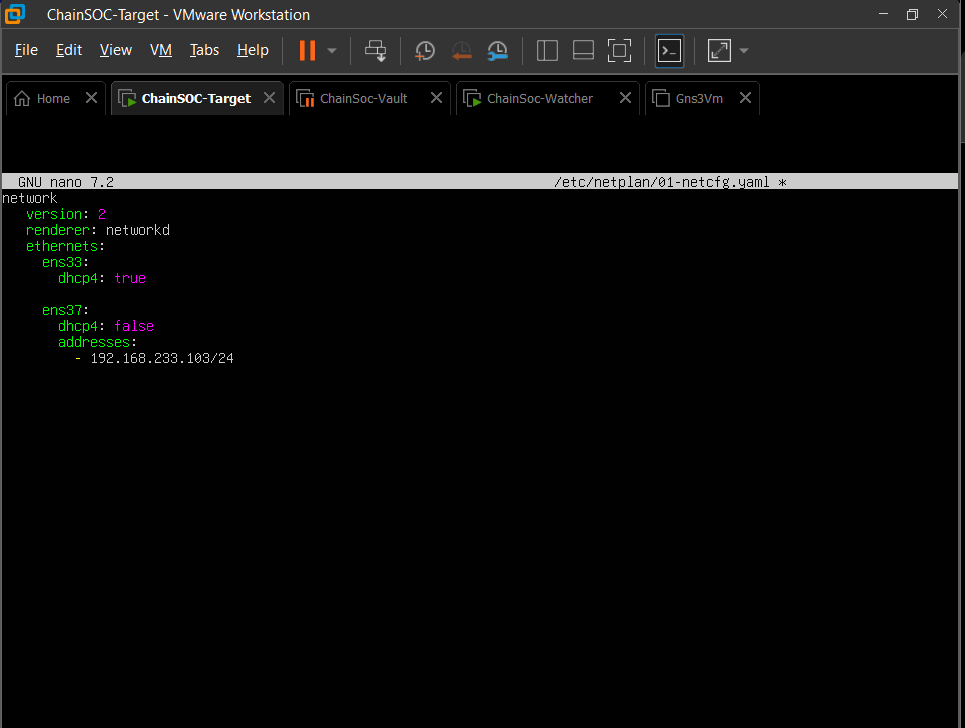
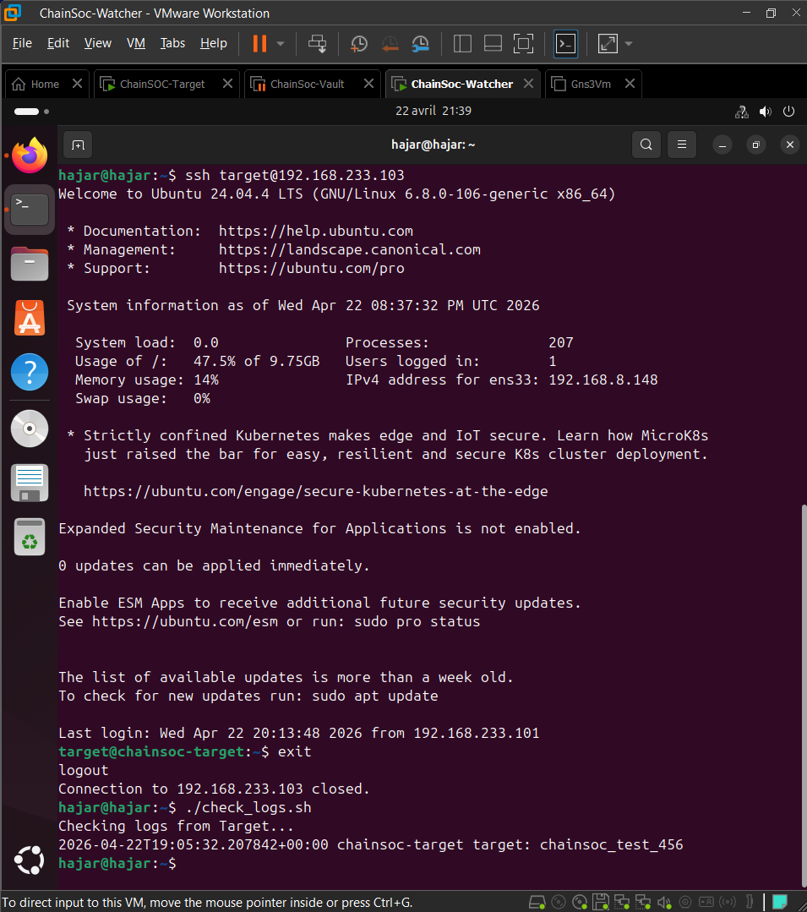
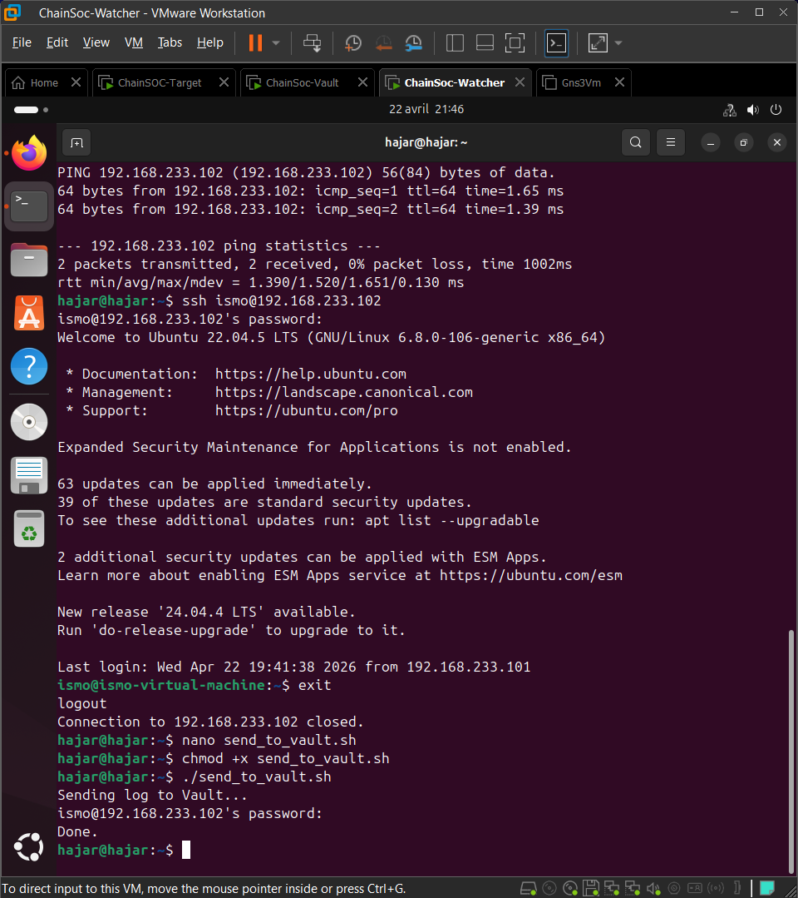
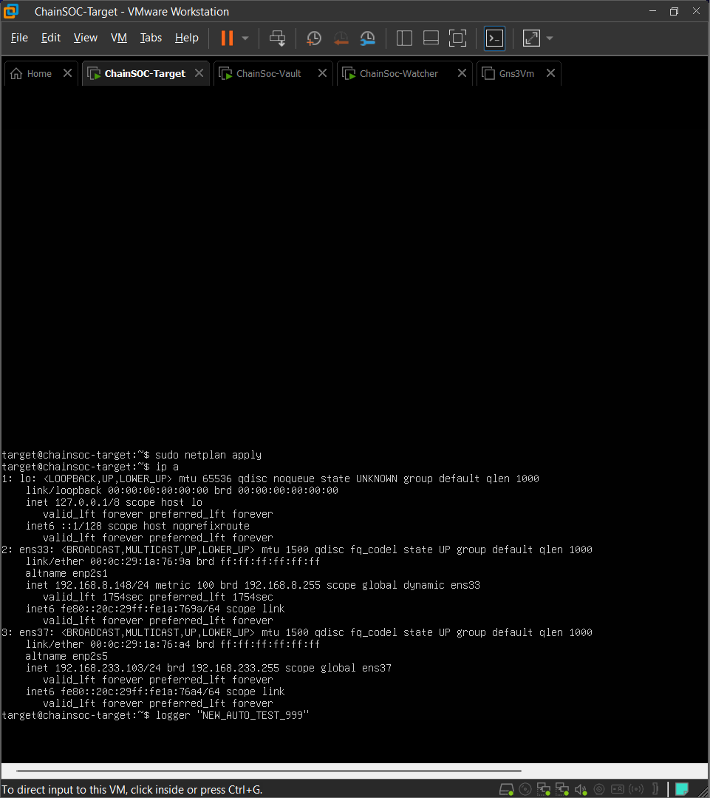
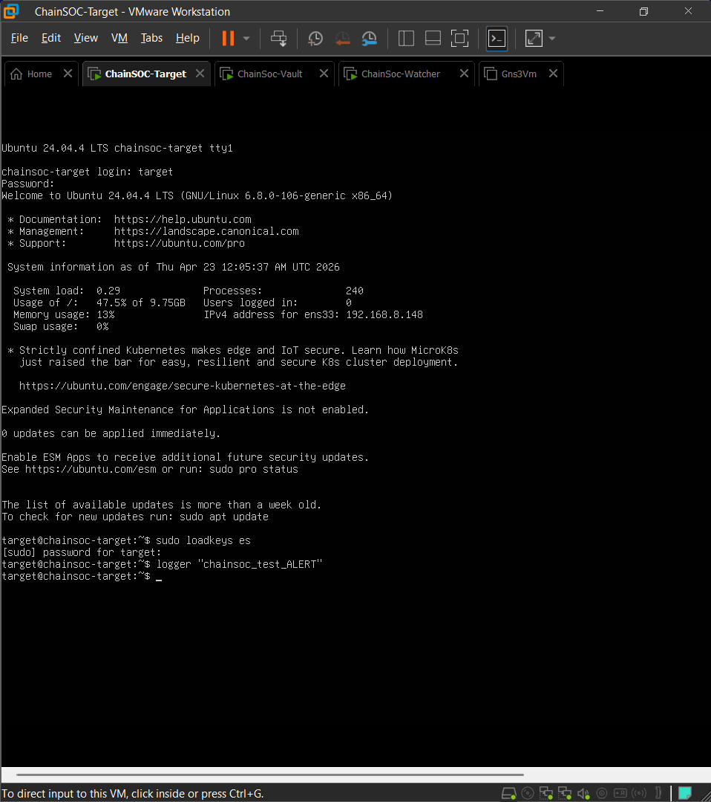

# Chain-Soc-Updates
## Project Overview

ChainSOC is a decentralized Security Information and Event Management (SIEM) prototype designed to demonstrate a distributed approach to security monitoring. The system operates across three interconnected virtual machines, each fulfilling a distinct role in the log collection, analysis, and storage pipeline. The project simulates a real-world SOC environment where security events are generated, monitored, and securely archived through automated workflows.

The primary objective of ChainSOC is to explore how decentralized architectures can enhance the integrity and resilience of security log management, laying the groundwork for future integration with blockchain-based immutable storage.

---

## Architecture

ChainSOC follows a three-tier architecture where each virtual machine operates as an independent node in the security monitoring chain:

```
+-------------------+         +-------------------+         +-------------------+
|   Target Machine  |  SSH    |  Watcher Machine  |  SSH    |   Vault Machine   |
|                   | ------> |                   | ------> |                   |
|  - Generates logs |         |  - Retrieves logs |         |  - Stores logs    |
|  - Simulates      |         |  - Detects threats|         |  - Secure archive |
|    suspicious     |         |  - Generates      |         |  - vault_logs.txt |
|    activity       |         |    alerts          |         |                   |
+-------------------+         +-------------------+         +-------------------+
```

**Data Flow:**

1. The **Target Machine** generates system logs and simulates suspicious activity using the Linux `logger` command.
2. The **Watcher Machine** connects to the Target via SSH, retrieves recent logs, and analyzes them for suspicious patterns.
3. When a suspicious log entry is detected, the Watcher generates an alert and records it in `alerts.txt`.
4. The Watcher forwards the collected logs to the **Vault Machine** via SSH for secure, centralized storage in `vault_logs.txt`.
5. The entire workflow is automated via cron jobs, executing every minute without manual intervention.

---

## Technologies Used

| Technology        | Purpose                                           |
|-------------------|---------------------------------------------------|
| Ubuntu 24.04 LTS  | Operating system for Target machine               |
| Ubuntu 22.04 LTS  | Operating system for Watcher and Vault machines   |
| VMware Workstation| Virtualization platform for all three VMs          |
| SSH (OpenSSH)     | Secure communication between machines             |
| Bash Scripting    | Automation of log retrieval, detection, and transfer |
| Cron Jobs         | Scheduled automation of the monitoring pipeline   |
| Linux Syslog      | System log generation and management              |
| journalctl        | Log querying and filtering on Target machine      |
| React             | Dashboard interface prototype (UI layer)          |

---

## Implementation Steps

### Step 1: Target Machine -- Network Configuration

The Target machine was configured with two network interfaces: `ens33` for external connectivity (DHCP, 192.168.8.148) and `ens37` for the internal ChainSOC network (static IP 192.168.233.103/24). The network configuration was defined using Netplan.





---

### Step 2: SSH Service Configuration

The SSH service was installed and configured on the Target machine to allow remote connections from the Watcher. A dedicated `watcher` user account was created on the Target to facilitate secure, role-based access. The SSH service status was verified to confirm it was active and listening on port 22.


---

### Step 3: SSH Communication Setup

SSH connectivity was established between all three machines in the ChainSOC network:

- **Target to Watcher:** Initial SSH connection test from the Target machine to verify network reachability.
- **Watcher to Vault:** SSH connection from the Watcher to the Vault machine (192.168.233.102) to enable log forwarding.


---

### Step 4: Log Generation on Target

Suspicious log entries were generated on the Target machine using the Linux `logger` command. These entries simulate security-relevant events that the Watcher must detect and process. The logs were written to the system journal and verified using `journalctl`.


---

### Step 5: Watcher -- Log Retrieval from Target

The Watcher machine was configured to remotely retrieve logs from the Target via SSH. A Bash script (`check_logs.sh`) was developed to automate this process. The script connects to the Target, queries the system journal for ChainSOC-related entries, and displays the results on the Watcher.


---

### Step 6: SSH Key-Based Authentication

To enable fully automated, passwordless communication between the Watcher and the Target, SSH key-based authentication was configured. An ED25519 key pair was generated on the Watcher and the public key was copied to the Target using `ssh-copy-id`. After this step, the Watcher can connect to the Target and execute commands without manual password entry.




---

### Step 7: Log Forwarding to Vault

A second Bash script (`send_to_vault.sh`) was developed on the Watcher to forward collected logs to the Vault machine. The script retrieves logs from the Target, and if a suspicious entry is found, it appends the log to `vault_logs.txt` on the Vault via SSH. The Vault machine was then accessed to verify that logs were correctly received and stored.




---

### Step 8: Cron Automation

The `send_to_vault.sh` script was scheduled as a cron job on the Watcher machine, configured to execute every minute (`* * * * *`). This ensures continuous, automated monitoring of the Target without manual intervention. After several cron cycles, the Vault machine was checked to confirm that logs were being accumulated automatically.





---

## Alert Detection

The alert detection mechanism is implemented within the `send_to_vault.sh` script on the Watcher machine. The script follows this logic:

1. Connect to the Target via SSH and retrieve the latest log entry matching the `chainsoc_test` pattern from `/var/log/syslog`.
2. If a matching log entry is found, the script triggers an alert by printing `"ALERT: Suspicious log detected!"` to the terminal.
3. The suspicious log entry is appended to the local `alerts.txt` file on the Watcher for record-keeping.
4. Simultaneously, the log entry is forwarded to the Vault machine and appended to `vault_logs.txt`.

This approach ensures that every suspicious event is both flagged locally and archived remotely.





---

## Automated Workflow

The following sequence describes the complete automated pipeline as it operates in the current implementation:

1. **Log Generation:** The Target machine generates a log entry (e.g., via `logger "chainsoc_test_ALERT"`), which is recorded in the system journal.
2. **Scheduled Retrieval:** The cron job on the Watcher fires every minute, executing `send_to_vault.sh`.
3. **Remote Log Query:** The script connects to the Target via SSH (using key-based authentication) and queries `/var/log/syslog` for the latest `chainsoc_test` entry.
4. **Threat Detection:** If a matching log is found, the script flags it as suspicious and writes an alert to `alerts.txt`.
5. **Secure Forwarding:** The detected log entry is forwarded to the Vault machine via SSH and appended to `vault_logs.txt`.
6. **Secure Storage:** The Vault machine accumulates all forwarded logs, providing a centralized and persistent record of security events.

---

## Current Results

The following features are fully operational in the current version of ChainSOC:

- Three virtual machines (Target, Watcher, Vault) configured and networked on a private subnet (192.168.233.0/24).
- SSH communication established between all machines with key-based authentication for automated access.
- Log generation on the Target using the Linux `logger` command with `journalctl` verification.
- Automated log retrieval from the Target by the Watcher via the `check_logs.sh` script.
- Suspicious log detection with alert generation on the Watcher, recorded in `alerts.txt`.
- Automated log forwarding from the Watcher to the Vault via the `send_to_vault.sh` script.
- Cron-based automation running the full pipeline every minute without manual intervention.
- Secure log storage on the Vault in `vault_logs.txt`, accumulating entries from all automated cycles.

---

## Future Improvements

The current implementation establishes the foundational infrastructure for a decentralized SIEM system. The following enhancements are planned for future iterations:

- **Blockchain Integration:** Implement a blockchain layer to create immutable, tamper-proof records of all security log entries, ensuring data integrity across the distributed system.
- **IPFS Storage:** Replace the file-based vault storage with the InterPlanetary File System (IPFS) for decentralized, content-addressed log archiving.
- **Smart Contract Logging:** Deploy smart contracts to automate log verification and provide cryptographic proof of log integrity on-chain.
- **Enhanced Dashboard:** Complete the React-based dashboard with real-time log visualization, alert notifications, and historical analysis capabilities connected to the backend automation pipeline.
- **Advanced Threat Detection:** Implement pattern-based and behavioral analysis rules for more sophisticated suspicious activity detection beyond simple string matching.

---

## Conclusion

ChainSOC successfully demonstrates a functional decentralized SIEM prototype built entirely on open-source technologies. The system achieves end-to-end automation of security log collection, threat detection, and secure storage across a distributed virtual machine infrastructure. The use of SSH for inter-machine communication, Bash scripting for automation logic, and cron for scheduling provides a robust and reproducible foundation. This project validates the feasibility of decentralized security monitoring and establishes a clear path toward integrating blockchain-based immutability in future development phases.
